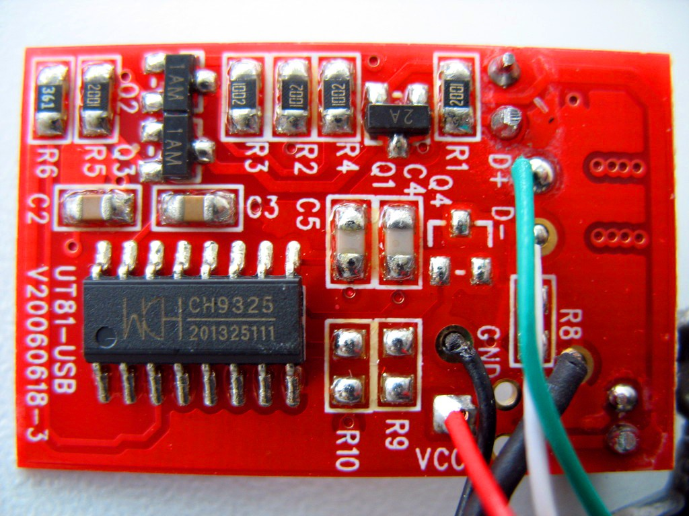
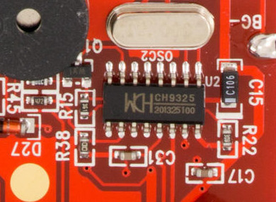

# WCH CH9325



WCH CH9325 in the UNI-T UT-D04 DMM cable.



WCH CH9325 in the UNI-T UT325 temperature logger.

[sigrok Website](https://sigrok.org/wiki/WCH_CH9325)

## Description

WCH, also known as Nanjing Qin Heng Electronics, makes a series of microcontrollers, PCI interface chips, and USB interface chips.

The CH9325 is a USB interface chip, which converts data received via UART to USB/HID and vice versa. The chip presents a HID (Human Interface Device) USB profile, in an effort to not require USB driver installation: this is typically handled by the OS kernel. Examples of the profile are included in the lsusb of the UNI-T UT-D04 DMM cable or the lsusb of the UNI-T UT325 temperature logger.

The chip runs off of a 12MHz oscillator.

## Pin layout

```text
               +----+
      RESET 1- |O   | -16 
    UART TX 2- |    | -15 VCC +5V
    UART RX 3- |    | -14 
     TX ACT 4- |    | -13 
 VCC select 5- |    | -12 
     USB D+ 6- |    | -11 
     USB D- 7- |    | -10 OSC+
        GND 8- |    | -9  OSC- 
               +----+
```

Pin 4 goes high while transmitting data on UART TX (i.e. USB -> device). This is possibly intended for an activity LED.

Assuming pin 5 (VCC select) has the same function as other WCH devices (such as CH341), tying it to GND via a decoupling capacitor selects +5V external power operation. Tying the pin to 3.3V selects 3.3V external power.

## Protocol

| Byte  | Description                                                                                                                                                                      |
|-------|----------------------------------------------------------------------------------------------------------------------------------------------------------------------------------|
| 1-2   | UART baudrate, in little-endian order. For example, 60 09 = 0x0960 = 2400. Supported baudrates are 2400, 4800, 9600 and 19200; setting any other rate defaults to 2400 instead.  |
| 3, 4  | uncertain purpose, probably parity and stop bits specs, often omitted, or 0x00 is sent                                                                                           |
| 5     | number of data bits (encoded, values 0-3 translate to 5-8 data bits)                                                                                                             |

Applications can get away with just sending the first two bytes. Vendor software has been observed sending 3 more bytes (00 00 03), but these seem to be not strictly required.

Even though the chip defaults to 2400 baud, that is not the default on startup: the baudrate setting command MUST still be sent.

### USB encapsulation

The chip stores bytes received via the UART RX pin into a buffer. It transfers the contents of the buffer to a HID packet at regular intervals (maximum 12ms). The HID packets are always 8 bytes long, with the first byte containing the number of payload bytes. This is encoded as 0xf0 + length. The next 7 bytes contain the payload, padded with zeroes. Thus, even if no data is ever received on the UART, the chip always sends at least one packet every 12ms containing:

```text
f0 00 00 00 00 00 00 00
```

Here's a packet with 2 bytes payload:

```text
f2 35 41 00 00 00 00 00
```

Extracting the UART stream on the other side of the USB bus simply entails the reverse process: for every received packet, extract the payload according to the length byte (nibble).

Transmit data is communicated in similar ways: The first byte contains the number of payload bytes which follow (without 0xf0 added as is the case for receive data). Up to 7 payload bytes follow. The complete block consists of exactly 8 bytes, with 0x00 padded when necessary.
